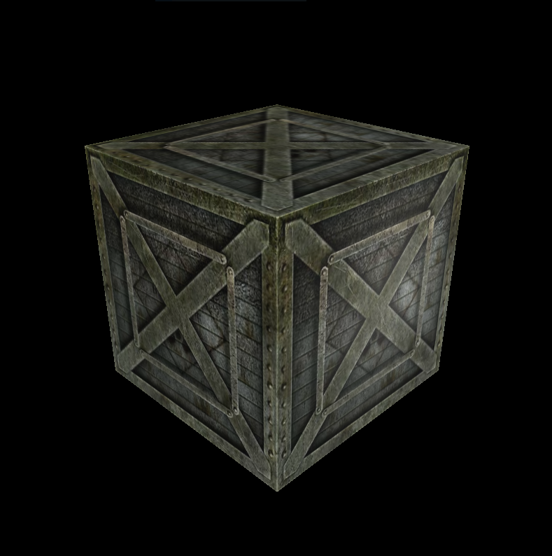

# OpenGL
Different projects using OpenGL with the purpose of learning how to implement various models in OpenGL and write shaders in GLSL. Some of the projects are related to my studies at Linköping University and the laboratory course in the class "Computer Graphics" (TNM046)

# Phong Lightning Model

The Phong Lightning Model consists of three terms: The ambient, the diffuse and the specular term. 
  
 
 
In the images we can see the difference between only ambient lightning and when the diffuse term also is added. 
<h2>Ambient light</h2>
The ambient term comes from the physical model of light and the fact that it scatters around us and when hitting other things it will reflect and therefore result in that some light reaches the object looked at. This is called ambient lightning and in this simple model it is implement as just the product between the ambient strength (that we set between 0 and 1) and the color of the light. 
<h2>Diffuse light</h2>
The diffuse light simulates the light that actually hits the object itself. We will give the pixels that are closer to the light rays from the light source more brightness than the pixels farther away. 
<h2>Specular light</h2>
Specular light is simulated based on the reflections of the light and how the viewer sees this. With the help of the position of the light and the viewer and the normal of the surface we can calculate the angular difference between the reflected light and the view direction. The closer angle between them, the greater influence of the specular light we will get. We will raise the specular component to a power of a number which we define as the 'shininess' of the object. The higher the value, the more the object reflects light instead of scattering and therefore we will get a more defined circle and smaller highlight. 
 
 

 
 
After the specular light is added. The difference between an exponent of 4 and one of 64.  

# Texturing
Implementations of texturing from images and with help of texturing coordinates calculated for the box. 
  
 
 
 
 
In the two images on the top you can see how the box looks when getting textures. In the lower images it is the same textures but now implemented in the Phong Shading Model as showed above. The diffuse term now comes from the texture instead of color. 
